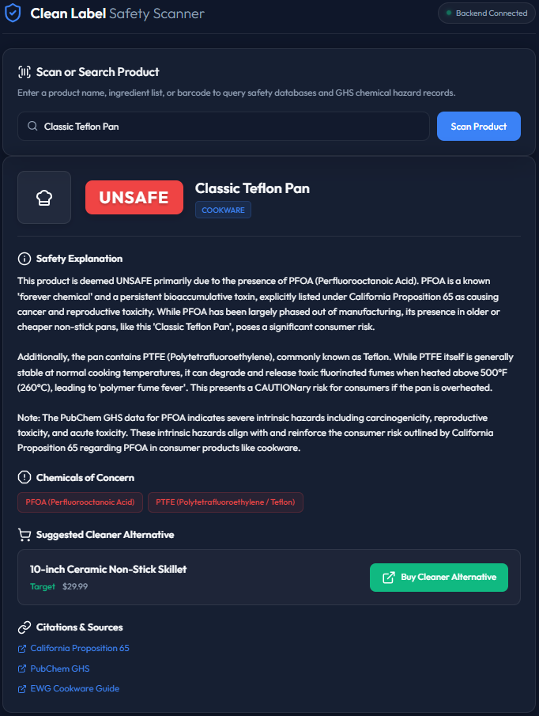
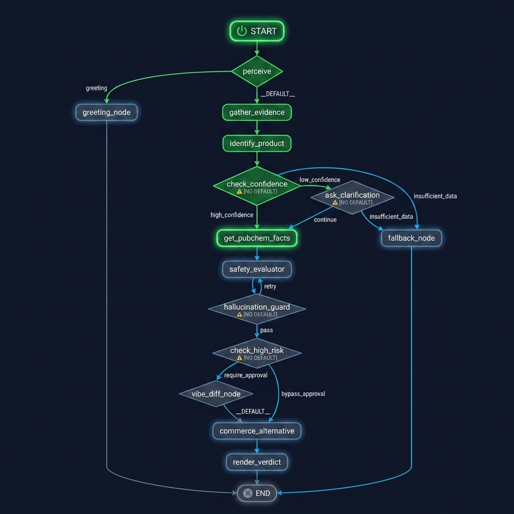
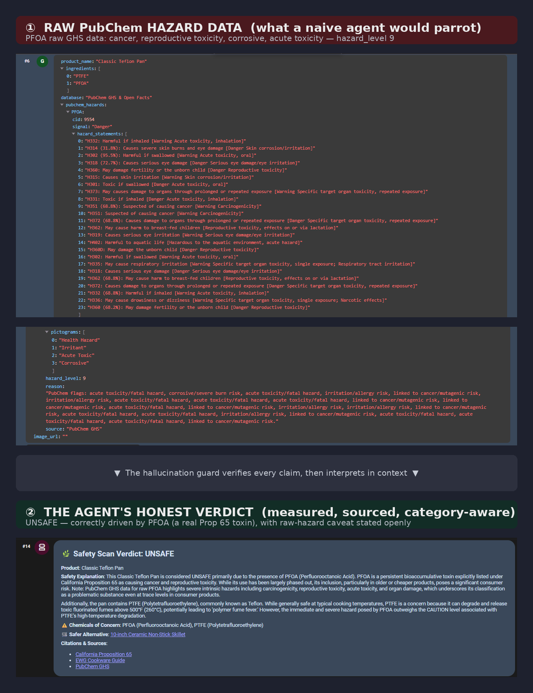
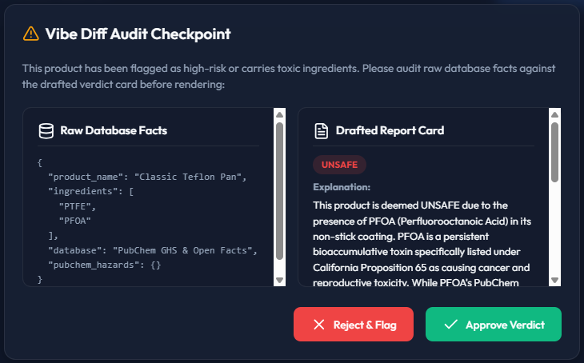

# 🌿 Clean Label Agent

> **An AI agent that tells you whether the products in your life are safe — and helps you find safer ones.**
> Submitted to the Google × Kaggle 5-Day AI Agents Capstone under the **Agents for Good** track.

Scan or name any consumer product — a food item, a piece of cookware, a skincare product, or a cleaning supply — and the Clean Label Agent identifies it, checks every ingredient against public safety databases, and returns a clear **SAFE / CAUTION / UNSAFE** verdict with a plain-English explanation, cited sources, and a safer alternative you can buy.

---

## 📑 Table of Contents
- [The Problem](#the-problem)
- [The Solution](#the-solution)
- [Why an Agent?](#why-an-agent)
- [Architecture](#architecture)
- [How It Works: The Agent Loop](#how-it-works-the-agent-loop)
- [Key Concepts Demonstrated](#key-concepts-demonstrated)
- [The Data Layer](#the-data-layer)
- [Safety Engineering: The Hallucination Guard](#safety-engineering-the-hallucination-guard)
- [Human-in-the-Loop Checkpoints](#human-in-the-loop-checkpoints)
- [Setup & Installation](#setup--installation)
- [Running the Agent](#running-the-agent)
- [Testing](#testing)
- [Evaluation: LLM-as-Judge](#evaluation-llm-as-judge)
- [Project Structure](#project-structure)
- [Team](#team)

---

## The Problem

Every day, people put products in, on, and around their bodies without any real way to know if they are safe. Ingredient labels are dense, written in unpronounceable INCI and chemical names, and mean nothing to the average shopper. Is the non-stick coating on that pan releasing PFAS? Does that "natural" face cream contain a formaldehyde-releasing preservative? Is that cleaning spray safe to use around kids?

The information *exists* — in food databases, cosmetic ingredient registries, and government chemical-hazard repositories — but it is scattered, technical, and inaccessible at the moment a person actually needs it: standing in a store, holding the product.

## The Solution

The **Clean Label Agent** closes that gap. Give it a product by **barcode, name, photo, or ingredient list**, and it:

1. **Identifies** what the product is and which category it belongs to.
2. **Retrieves** its ingredients from the matching open database.
3. **Checks** every ingredient's hazard profile against PubChem's regulatory chemical data.
4. **Interprets** those hazards *in the context of how the product is actually used* — not as raw industrial chemicals.
5. **Delivers** a SAFE / CAUTION / UNSAFE verdict with a clear reason, cited sources, and a safer alternative.

> **Example:** Scan a non-stick pan → the agent detects a PFOA-based coating → verdict **UNSAFE** → it explains why PFOA is a concern for cookware → and suggests a ceramic-coated alternative you can buy.

<!-- Screenshot: the premium consumer UI showing a verdict card — the UNSAFE Teflon pan card (red badge, PFOA/PTFE tags, ceramic-pan safer alternative, buy button, citations) is the strongest choice. Save as docs/verdict-card.png -->


## Why an Agent?

This problem is a natural fit for an agent rather than a simple lookup script, because answering it well requires **autonomous, multi-step reasoning across several tools**:

- It must **decide** what the product is before it can know which database to query.
- It must **orchestrate** multiple data sources (three product databases plus a chemical-hazard database) and reconcile them.
- It must **delegate** specialized toxicology assessment to a sub-agent.
- It must **judge its own confidence** and ask a human when unsure.
- It must **refuse to make claims it cannot verify.**

That chain of perceive → decide → act → verify → explain is exactly what an agentic architecture is for. A static function can't route, reason, or hold itself accountable the way this task demands.

## Architecture

The diagram below is the agent's actual execution graph, showing every node in the workflow — from perception and confidence-gated clarification through the PubChem hazard lookup, the hallucination guard, the human-in-the-loop Vibe Diff, and the final verdict with a safer-alternative offer.



<details>
<summary><b>Annotated text flow</b> (click to expand — shows how each course concept maps to the graph)</summary>

```
                    ┌─────────────────────────────┐
   User input  ───► │      PERCEIVE / IDENTIFY    │
 (barcode/name/     │  LLM router + 3 databases + │
  photo/list)       │  web search + vision        │
                    └──────────────┬──────────────┘
                                   │  confidence check
                        ┌──────────┴──────────┐
                   HIGH │                     │ LOW
                        ▼                     ▼
                 (proceed)          ┌──────────────────┐
                        │           │  ASK THE HUMAN   │  ◄── Human-in-the-loop #1
                        │           │  which category? │
                        │           └────────┬─────────┘
                        ▼                    │
              ┌─────────────────────────────────────────┐
              │        RETRIEVE INGREDIENTS (MCP)       │
              │  Open Food / Beauty / Products Facts    │
              └──────────────────┬──────────────────────┘
                                 ▼
              ┌─────────────────────────────────────────┐
              │     HAZARD LOOKUP — PubChem PUG-REST    │
              │     GHS classification + toxicity       │
              └──────────────────┬──────────────────────┘
                                 ▼
              ┌─────────────────────────────────────────┐
              │   TOXICOLOGY SUB-AGENT (A2A delegation) │
              └──────────────────┬──────────────────────┘
                                 ▼
              ┌─────────────────────────────────────────┐
              │        HALLUCINATION GUARD              │  ◄── every claim verified
              │  every chemical must exist in raw JSON  │      against source data
              └──────────────────┬──────────────────────┘
                                 ▼
              ┌─────────────────────────────────────────┐
              │      BEFORE/AFTER VIBE DIFF (review)    │  ◄── Human-in-the-loop #2
              └──────────────────┬──────────────────────┘
                                 ▼
              ┌─────────────────────────────────────────┐
              │  VERDICT + A2UI CARD + SAFER ALTERNATIVE│
              │  SAFE / CAUTION / UNSAFE + buy link     │
              └─────────────────────────────────────────┘

         (OpenTelemetry traces every stage above)
```
</details>

## How It Works: The Agent Loop

The core loop lives in `src/agent.py` and follows a **perceive → plan → act → observe → iterate** cycle:

| Stage | What happens |
|-------|--------------|
| **Perceive** | Accept a barcode, product name, photo, or ingredient list. |
| **Plan** | The LLM identifies the product and category, then selects which skill and database to use. |
| **Act** | Query the matching Open Facts database for ingredients, then PubChem for each ingredient's hazard profile. |
| **Observe** | Cross-check sources; the hallucination guard verifies every claim against the raw data. |
| **Iterate** | If confidence is low or a claim can't be verified, re-query, ask the human, or return UNKNOWN. |

## Key Concepts Demonstrated

This project demonstrates **all six** of the course's key concepts (only three were required).

| Course Concept | Where It Lives | What It Does |
|----------------|----------------|--------------|
| **Agent / Multi-agent (ADK)** | `src/agent.py`, `src/agents/toxicology.py` | Core loop orchestrates a toxicology sub-agent via A2A delegation. |
| **MCP Server** | `src/tools/mcp_client.py` | Connects to four public data sources through the Model Context Protocol. |
| **Antigravity** | *(see video)* | The entire agent was vibe-coded in Gemini Antigravity. |
| **Security features** | `src/agent.py` guard, `src/checkpoints/vibe_diff.py` | Hallucination guard + two human-in-the-loop checkpoints. |
| **Agent skills** | `skills/*/SKILL.md` + semantic routing in `src/agent.py` | One agent flexes into four specialist roles via progressively disclosed skills. |
| **Deployability** | `Dockerfile` *(optional)* | Packaged for Google Cloud Run. |

## The Data Layer

The agent uses **four free, no-API-key public data sources**, in two layers.

**Layer 1 — Product → Ingredients** (chosen by identified category):

| Category | Source |
|----------|--------|
| Food | Open Food Facts |
| Skincare / cosmetics | Open Beauty Facts |
| Cookware / cleaning / other | Open Products Facts |

**Layer 2 — Ingredient → Hazard:**

Every ingredient identified in Layer 1 is looked up in **PubChem PUG-REST**, the U.S. National Library of Medicine's chemical database, for its GHS hazard classification and toxicity data. This is the agent's factual ground truth. (PubChem allows a maximum of 5 requests/second, so calls are rate-limited and cached.)

If a product cannot be found in any database, the agent falls back to a web search to identify it; if it still cannot be identified, it returns **UNKNOWN — insufficient data** rather than guessing.

## Safety Engineering: The Hallucination Guard

The single most important safety feature. Because the agent makes **health claims**, it must never invent a hazard.

The guard enforces one rule: *every chemical hazard the agent reports must be traceable to the raw JSON returned by a database.* If the model's draft verdict cites a chemical (e.g. "contains PFOA") but that string — or a known synonym — does not appear in the retrieved data, **validation fails and the agent is forced back into the iterate loop** instead of returning the unverified claim.

Just as important, the guard distinguishes the **intrinsic hazard of a raw chemical** from the **actual risk of that ingredient in a finished product at normal use.** A GHS "harmful if swallowed" note on a raw industrial material does **not**, by itself, make a leave-on cosmetic UNSAFE. Hazard interpretation is routed by category: ingestion risk matters for food, skin-absorption and allergen risk for skincare, off-gassing and contact risk for cleaning and cookware. This prevents the agent from being alarmist about benign ingredients.

<!-- Screenshot: raw PubChem hazard data (e.g. aluminum flagged "catches fire / damages organs") next to the honest verdict that says these are industrial-handling hazards, not consumer risk. Save as docs/hallucination-guard.png -->


## Human-in-the-Loop Checkpoints

The agent pauses for a human at **two** points, but only when it matters:

1. **Identification checkpoint** — if the agent's confidence in *what the product is* is low, it asks the user to confirm the category (food / skincare / cookware / cleaning) rather than guessing.
2. **Verdict checkpoint (Vibe Diff)** — before showing a high-stakes verdict, it presents a side-by-side comparison of the raw database findings versus its own interpreted summary, so a human can confirm nothing was exaggerated or downplayed.

Both checkpoints are recorded in the OpenTelemetry trace, making every human decision observable.

<!-- Screenshot: the Vibe Diff Audit Checkpoint modal — raw database facts on the left, drafted verdict on the right, Approve/Reject buttons. Save as docs/vibe-diff.png -->


## Setup & Installation

### Prerequisites
- Python 3.10 or higher
- `git`

### Steps

```bash
# 1. Clone the repository
git clone https://github.com/YOUR_USERNAME/clean-label-agent.git
cd clean-label-agent

# 2. Create and activate a virtual environment
python -m venv venv
source venv/bin/activate        # On Windows: venv\Scripts\activate

# 3. Install dependencies
pip install -r requirements.txt
```

> **Note:** No API keys are required. All four data sources (Open Food Facts, Open Beauty Facts, Open Products Facts, and PubChem) are free and open, with no authentication. **Do not commit any secrets to this repo.**

## Running the Agent

You can run the agent locally using the **Google Agent Development Kit (ADK) CLI**:

```bash
# 1. Start local interactive CLI session
python -m google.adk.cli run src/

# 2. Run with a single query directly (e.g. Teflon Pan)
python -m google.adk.cli run src/ "Classic Teflon Pan"

# 3. Start the Web Playground and developer trace UI
python -m google.adk.cli web src/ --port 8501 --allow_origins=*
```

The agent prints its verdict, explanation, cited sources, and a safer alternative, and (if the UI layer is enabled) renders an interactive safety card.

## Testing

The test suite is generated from the behavior-driven specification in `specs/clean-label.yaml`. Each Gherkin scenario maps to one test.

```bash
pytest tests/ -v
```

Scenarios covered include: a food item with a banned additive → UNSAFE; a PFOA-coated pan → UNSAFE with a safer alternative; a clean skincare product → SAFE; an unidentifiable product → UNKNOWN; and a high-risk verdict requiring human approval before display.

## Evaluation: LLM-as-Judge

Beyond deterministic unit tests, the agent is validated with an **LLM-as-Judge evaluation suite** built on the ADK eval framework — the pattern recommended in the course for scoring behavior that rules alone can't capture. Rather than asking "did the function return the right value?", it asks "is the agent's verdict correct, well-sourced, and honest?"

The suite (`tests/test_eval_llm_judge.py`) runs a **golden dataset of 12 real products** (`tests/golden_dataset.json`) — three per category, spanning SAFE, CAUTION, and UNSAFE — through the live agent, using real barcodes where available and falling back to brand names otherwise. A Gemini judge then scores each output against a four-part rubric:

1. Was the correct product **category** identified?
2. Does the **verdict** match the expected one? (SAFE and UNSAFE must match exactly; CAUTION uses a tolerance band, since a borderline product may reasonably read as SAFE.)
3. Does the explanation **cite at least one real source**?
4. Is the explanation **non-alarmist** — does it distinguish raw-chemical/industrial hazard from finished-product consumer risk?

Following the course's guidance on LLM-as-Judge, each case is scored **twice with the reference and actual outputs swapped** to neutralize ordering bias, and the scores are averaged.

**Golden dataset:** Quaker Oats, Coca-Cola, Oscar Mayer Bacon (food); Vanicream, a fragrance lotion, a DMDM-hydantoin lotion (skincare); Dr. Bronner's, Method cleaner, Clorox bleach (cleaning); All-Clad, a PFOA-free T-fal pan, a classic PFOA Teflon pan (cookware).

```bash
pytest tests/test_eval_llm_judge.py -s
```

**Result: all 12 verdicts classified correctly.** All 12 product safety verdicts were classified correctly across every evaluation case; the LLM judge scored the explanations at 7–10 out of 10, passing all cases under neutralized order bias. (The score range reflects the nature of LLM-as-Judge scoring — a language model returns slightly different numeric scores for the same output across runs; the underlying verdicts were stable and correct every time.) Every SAFE and UNSAFE verdict matched exactly; the CAUTION cases use a tolerance band, since a borderline product may reasonably read as SAFE. Full per-case results are written to `tests/eval_results_summary.json`.

| Case ID | Product | Barcode / Input | Category | Expected | Actual | Result |
|---------|---------|-----------------|----------|----------|--------|--------|
| FOOD-SAFE | Quaker Old Fashioned Rolled Oats | 030000010204 | food | SAFE | SAFE | ✅ PASS |
| FOOD-CAUTION | Coca-Cola Classic | 049000006346 | food | CAUTION | CAUTION | ✅ PASS |
| FOOD-UNSAFE | Oscar Mayer Bacon | 044700000632 | food | UNSAFE | UNSAFE | ✅ PASS |
| COSMETIC-SAFE | Vanicream Moisturizing Cream | 345334300168 | skincare | SAFE | SAFE | ✅ PASS |
| COSMETIC-CAUTION | Bath & Body Works Fragrance Lotion | name only | skincare | CAUTION | CAUTION | ✅ PASS |
| COSMETIC-UNSAFE | Suave Lotion (DMDM hydantoin) | name only | skincare | UNSAFE | UNSAFE | ✅ PASS |
| CLEANING-SAFE | Dr. Bronner's Pure-Castile Liquid Soap | 018787771259 | cleaning | SAFE | SAFE | ✅ PASS |
| CLEANING-CAUTION | Method All-Purpose Cleaner | name only | cleaning | CAUTION | CAUTION | ✅ PASS |
| CLEANING-UNSAFE | Clorox Regular Bleach | 044600324135 | cleaning | UNSAFE | UNSAFE | ✅ PASS |
| COOKWARE-SAFE | All-Clad D3 Stainless Steel Fry Pan | name only | cookware | SAFE | SAFE | ✅ PASS |
| COOKWARE-CAUTION | T-fal PFOA-Free Non-Stick Pan | name only | cookware | CAUTION | CAUTION | ✅ PASS |
| COOKWARE-UNSAFE | Classic Teflon Pan (PFOA) | name only | cookware | UNSAFE | UNSAFE | ✅ PASS |

**12/12 verdicts correct · all barcodes resolved · judge explanation scores 7–10/10**

## Project Structure

```
clean-label-agent/
├── AGENTS.MD                     # Golden-rule file guiding the coding agent
├── README.md                     # You are here
├── Dockerfile                    # (optional) Cloud Run deployment
├── requirements.txt
├── specs/
│   └── clean-label.yaml          # Gherkin BDD spec — the source of truth
├── src/
│   ├── agent.py                  # Core agent loop + guard + semantic routing
│   ├── tools/
│   │   └── mcp_client.py         # MCP connections to the 4 data sources
│   ├── agents/
│   │   └── toxicology.py         # A2A toxicology sub-agent
│   ├── ui/
│   │   └── report_card.py        # A2UI safety card
│   ├── checkpoints/
│   │   └── vibe_diff.py          # Before/after human-in-the-loop
│   ├── commerce/
│   │   └── safer_alt.py          # AP2/UCP safer-alternative purchase
│   └── observability/
│       └── tracer.py             # OpenTelemetry tracing
├── skills/
│   ├── food/SKILL.md
│   ├── cookware/SKILL.md
│   ├── skincare/SKILL.md
│   └── cleaning/SKILL.md
└── tests/
    ├── test_clean_label.py       # Gherkin-derived unit tests
    ├── test_eval_llm_judge.py    # LLM-as-Judge evaluation suite
    └── golden_dataset.json       # 12-product golden evaluation set
```

## Team

| Role | Responsibilities |
|------|------------------|
| **Anahita Esmaeilian** — Lead / Architect | Core agent loop, MCP client, hallucination guard, OpenTelemetry, semantic skill routing, documentation |
| **Ali Mahdavi** — Specialist | Agent skills, toxicology sub-agent, A2UI card, Vibe Diff, commerce integration, tests |

Kaggle usernames: `anahitaesmaeilian`, `alimahdavimazdeh`

---

<!-- TODO before submission:
  1. Add docs/architecture.png (your architecture diagram)
  2. Add a screenshot of the A2UI safety card
  3. Add a screenshot of an OpenTelemetry trace
  4. Fill in real names, Kaggle usernames, and the repo URL
  5. Confirm the run commands match your actual CLI entry point
-->

*Built with Gemini Antigravity for the Google × Kaggle 5-Day AI Agents Capstone — Agents for Good.*
