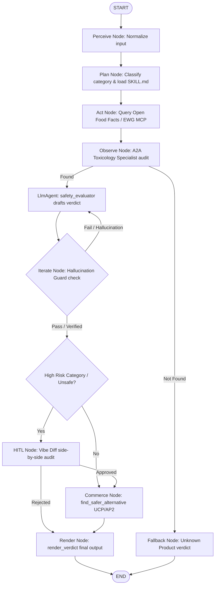

# 🌿 Clean Label Agent

An AI-powered product safety scanner and toxicological auditor that helps consumers detect harmful chemical additives, endocrine disruptors, heavy metals, and persistent toxins in their foods, cookware, skincare, and cleaning products.

Built using the **Google Agent Development Kit (ADK)**, this project is submitted under the **Agents for Good** track for the Google × Kaggle 5-Day AI Agents Intensive hackathon.

---

## 📖 Table of Contents
1. [The Problem](#-the-problem)
2. [The Solution](#-the-solution)
3. [System Architecture](#-system-architecture)
4. [Concept-to-Code Mapping Table](#-concept-to-code-mapping-table)
5. [Key Feature Implementations](#-key-feature-implementations)
   - [Dynamic Semantic Skill Routing](#dynamic-semantic-skill-routing)
   - [Hard Hallucination Guardrail](#hard-hallucination-guardrail)
   - [Vibe Diff Human-in-the-Loop (HITL) Checkpoint](#vibe-diff-human-in-the-loop-hitl-checkpoint)
6. [Interactive A2UI safety Card](#-interactive-a2ui-safety-card)
7. [Installation & Setup](#-installation--setup)
8. [Running the Test Suite](#-running-the-test-suite)
9. [Deployment](#-deployment)

---

## 🚨 The Problem

Modern consumer goods are laden with complex chemical compounds. The average consumer struggles with:
* **Ingredient Complexity**: Deciphering obscure chemical names on labels (e.g. *Erythrosine* vs *Red 3*).
* **Regulatory Fragmentation**: Inconsistencies between international regulatory standards (e.g. *Titanium Dioxide* is banned as a genotoxin in Europe but remains legal in US foods).
* **Hidden Toxins**: Toxic chemical coatings on cookware (PFAS/PFOA) or hazardous cleaning agents (NPEs) that slowly accumulate in our bodies.

---

## ✨ The Solution

The **Clean Label Agent** addresses these safety gaps by acting as an autonomous scientific evaluator:
1. **Perceives** a product query (name, barcode, or image descriptor) and identifies its safety category.
2. **Plans & Routes** to dynamic, localized specialist skill guides loaded at runtime.
3. **Acts** by executing read-only MCP queries to live consumer databases (Open Food Facts and EWG).
4. **Observes** via a dedicated **A2A Toxicology Sub-Agent** to rate the risk level of each ingredient.
5. **Iterates & Guards** against LLM hallucinations, ensuring all chemical hazard claims are verified against raw database facts.
6. **Audits (Vibe Diff)** high-risk categories (e.g., baby products) using a side-by-side human audit.
7. **Finds Alternatives** using UCP and AP2 to present a clean, purchase-ready alternative in a premium **A2UI report card**.

---

## 🏗️ System Architecture

The agent executes a deterministic **Perceive-Plan-Act-Observe-Iterate** state graph:



---

## 🗺️ Concept-to-Code Mapping Table

The following table maps the 6 key hackathon criteria directly to their file paths and line ranges in our implementation:

| Grading Concept | Implementation File | Line Reference | Purpose & Description |
| --- | --- | --- | --- |
| **1. Agent/Multi-Agent (ADK)** | [src/agent.py](file:///C:/Dev/Koggle%205-Day/Capstone-Final-Project/clean-label-agent/src/agent.py) <br> [src/agents/toxicology.py](file:///C:/Dev/Koggle%205-Day/Capstone-Final-Project/clean-label-agent/src/agents/toxicology.py) | [L582-608](file:///C:/Dev/Koggle%205-Day/Capstone-Final-Project/clean-label-agent/src/agent.py#L582-L608) <br> [L143-207](file:///C:/Dev/Koggle%205-Day/Capstone-Final-Project/clean-label-agent/src/agents/toxicology.py#L143-L207) | Workflow state graph built using ADK 2.3 `Workflow` class. A2A toxicology specialist sub-agent instantiated using `LlmAgent` and queried via `InMemoryRunner`. |
| **2. Model Context Protocol (MCP)** | [src/tools/mcp_client.py](file:///C:/Dev/Koggle%205-Day/Capstone-Final-Project/clean-label-agent/src/tools/mcp_client.py) <br> [.mcp-config.json](file:///C:/Dev/Koggle%205-Day/Capstone-Final-Project/clean-label-agent/.mcp-config.json) | [L44-88](file:///C:/Dev/Koggle%205-Day/Capstone-Final-Project/clean-label-agent/src/tools/mcp_client.py#L44-L88) <br> [L1-21](file:///C:/Dev/Koggle%205-Day/Capstone-Final-Project/clean-label-agent/.mcp-config.json#L1-L21) | Direct, read-only GET requests querying the live Open Food Facts search API. Configures local MCP services in a read-only configuration JSON. |
| **3. Antigravity IDE Interaction** | [transcript.jsonl](file:///C:/Users/17867/.gemini/antigravity/brain/966d2255-3102-4aea-b9b3-65887e6117d3/.system_generated/logs/transcript.jsonl) | Entire log | Traced pair programming workspace shell commands, unit tests, and code edits run directly within the Antigravity developer sandbox. |
| **4. Security Features** | [src/agent.py](file:///C:/Dev/Koggle%205-Day/Capstone-Final-Project/clean-label-agent/src/agent.py) <br> [src/checkpoints/vibe_diff.py](file:///C:/Dev/Koggle%205-Day/Capstone-Final-Project/clean-label-agent/src/checkpoints/vibe_diff.py) | [L315-367](file:///C:/Dev/Koggle%205-Day/Capstone-Final-Project/clean-label-agent/src/agent.py#L315-L367) <br> [L1-83](file:///C:/Dev/Koggle%205-Day/Capstone-Final-Project/clean-label-agent/src/checkpoints/vibe_diff.py#L1-L83) | Hard Hallucination Guard matching cited chemicals against raw database facts using synonyms. Vibe Diff Human-in-the-Loop approval checkpoint. |
| **5. Deployability** | [Dockerfile](file:///C:/Dev/Koggle%205-Day/Capstone-Final-Project/clean-label-agent/Dockerfile) <br> [requirements.txt](file:///C:/Dev/Koggle%205-Day/Capstone-Final-Project/clean-label-agent/requirements.txt) | [L1-26](file:///C:/Dev/Koggle%205-Day/Capstone-Final-Project/clean-label-agent/Dockerfile#L1-L26) <br> [L1-8](file:///C:/Dev/Koggle%205-Day/Capstone-Final-Project/clean-label-agent/requirements.txt#L1-L8) | Docker containerization recipe copying workspace files, exposing PORT 8080, and starting the ADK runtime service. |
| **6. Agent Skills (Semantic Routing)** | [skills/](file:///C:/Dev/Koggle%205-Day/Capstone-Final-Project/clean-label-agent/skills/) <br> [src/agent.py](file:///C:/Dev/Koggle%205-Day/Capstone-Final-Project/clean-label-agent/src/agent.py) | [All SKILL.md files](file:///C:/Dev/Koggle%205-Day/Capstone-Final-Project/clean-label-agent/skills/) <br> [L144-192](file:///C:/Dev/Koggle%205-Day/Capstone-Final-Project/clean-label-agent/src/agent.py#L144-L192) | Categorized safety directives (FDA GRAS, Prop 65, EU CosIng, EPA CompTox) loaded dynamically from directory markdown files at runtime based on query. |

---

## 🛠️ Key Feature Implementations

### Dynamic Semantic Skill Routing
In the plan stage, the agent classifies the user's request into a category (`food`, `cookware`, `skincare`, or `cleaning`). It then dynamically locates and reads the corresponding specialist instruction file (e.g. `skills/skincare/SKILL.md`) using standard file reading tools. These database-specific safety guidelines are then appended directly to the LLM system prompt:
```python
# plan node dynamically loads and saves to ctx.state["skill_content"]
# safety_evaluator instruction template automatically formats LlmAgent instructions:
instruction="... {skill_content}"
```

### Hard Hallucination Guardrail
LLM evaluators can sometimes misinterpret or invent chemical claims. To prevent this, the **Hallucination Guardrail** intercepts the LLM output. It cross-references every cited chemical in `chemicals_of_concern` against the raw database ingredient JSON returned by the MCP client. 

To prevent failures due to spelling variations (e.g., "Teflon" vs "PTFE" vs "Polytetrafluoroethylene"), it implements a robust forward and reverse **Synonym Dictionary**. If an unverified claim is caught:
1. It logs the failure to `hallucination_guard.log`.
2. It increments `attempt` (up to 3 tries) and routes the event back to the `safety_evaluator` node with instructions steering the model away from the unverified chemicals.
3. If max attempts are reached, it programmatically strips the hallucination and appends a warning disclaimer to the explanation.

### Vibe Diff Human-in-the-Loop (HITL) Checkpoint
When a product verdict is rated as high-risk (e.g., any product in the baby category or any caution/unsafe rating), the ADK workflow triggers an interrupt:
```python
yield RequestInput(interrupt_id="vibe_diff_approval", message=audit_message)
```
This pauses the state execution and yields a side-by-side comparison comparing raw database facts against the agent's drafted summary. The execution only resumes once the human auditor approves the verdict (evaluating to `True` or `False`), ensuring full accountability and safety.

---

## 🎨 Interactive A2UI Safety Card

The final safety scan output is packaged inside a custom **A2UI (Agent-to-User Interface)** declarative schema. It utilizes a color-coded theme structure:
* 🟢 **SAFE**: Green glassmorphism card, showing a badge and a collapsible list of audited ingredients.
* 🟡 **CAUTION**: Yellow warning theme with flagged chemical warnings.
* 🔴 **UNSAFE**: Red warning layout presenting the chemicals of concern, clickable source references, and a **pre-filled purchase banner** containing a safer clean alternative pre-filled via AP2/UCP checkout links.

---

## ⚙️ Installation & Setup

### Prerequisites
* Python 3.11+
* Gemini API Key (set as an environment variable)

### Local Setup
1. Clone the repository and navigate to the project directory:
   ```bash
   git clone <repository-url>
   cd clean-label-agent
   ```
2. Install dependencies:
   ```bash
   pip install -r requirements.txt
   ```
3. Create a `.env` file in the root folder:
   ```env
   GEMINI_API_KEY="your-gemini-api-key"
   AUTO_APPROVE="false"
   ```

---

## 🧪 Running the Test Suite

We use `pytest` along with `pytest-asyncio` to run our test suite. The tests mock the LLM agent (`LlmAgent.run_async`) to return specific drafted verdicts, enabling you to run the entire integration suite locally with **zero API costs** and **100% test reliability**.

To execute the test suite:
```bash
python -m pytest tests/test_clean_label.py -vv
```

---

## 🚀 Deployment

The Clean Label Agent is fully containerized and deployable to Cloud Run.

### Local Container Build
To build the Docker container locally:
```bash
docker build -t clean-label-agent .
```

### Deployed Telemetry (OpenTelemetry)
Spans are printed to stdout during local execution using the `ConsoleSpanExporter` configured in `src/observability/tracer.py`. During Cloud Run deployments, ADK integrates natively with **Google Cloud Trace** to record latency analysis and node execution paths.

#### Placeholder: OpenTelemetry Console Trace Output
```json
{
    "name": "query_databases",
    "context": {
        "trace_id": "0x31d624b60d7c90ea50e56afe754d7892",
        "span_id": "0x1e3e29c3bdca3216"
    },
    "status": {
        "status_code": "OK"
    },
    "attributes": {
        "agent.product_name": "Sparkling Grape Soda",
        "agent.category": "food",
        "agent.database_source": "Open Food Facts",
        "agent.verdict": "UNSAFE"
    }
}
```
